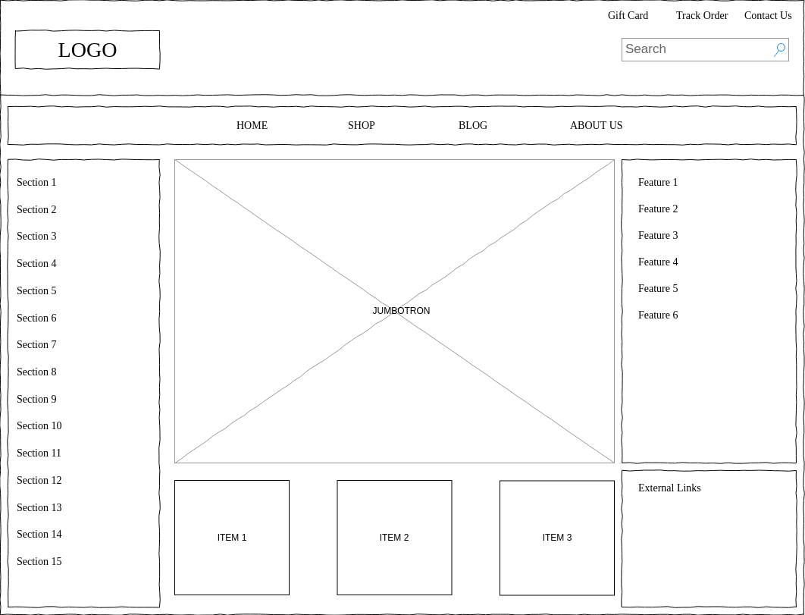

# Day#3 Bootstrap

## Objectives
Create `index.html` adding bootstrap with 

```
<link rel="stylesheet" href="https://stackpath.bootstrapcdn.com/bootstrap/4.3.1/css/bootstrap.min.css" 
integrity="sha384-ggOyR0iXCbMQv3Xipma34MD+dH/1fQ784/j6cY/iJTQUOhcWr7x9JvoRxT2MZw1T" crossorigin="anonymous">
```
or adding bootstrap css file into your local folder.

Create html slicing with wireframe below.



Notes:
- For Jumbotron section, you can use a static image, slider, or carousel. 
- Box ITEM1 etc are Card element containing image (use Bootstrap's Card component). It should contain price, description, and Add to Card button.